# Claude Code Workflow Design

**Date:** 2026-03-18
**Status:** Approved
**Depends on:** 2026-03-18-p2p-network-design.md

---

## Context

Each `inv` installation is an independent node with its own SQLite database. Claude Code connects to `inv` via MCP. This design defines how humans and AI agents interact with the inventory network through Claude Code.

## Operating Model

One human developer orchestrates multiple AI agents. Each AI agent runs its own `inv` node for a specific vertical.

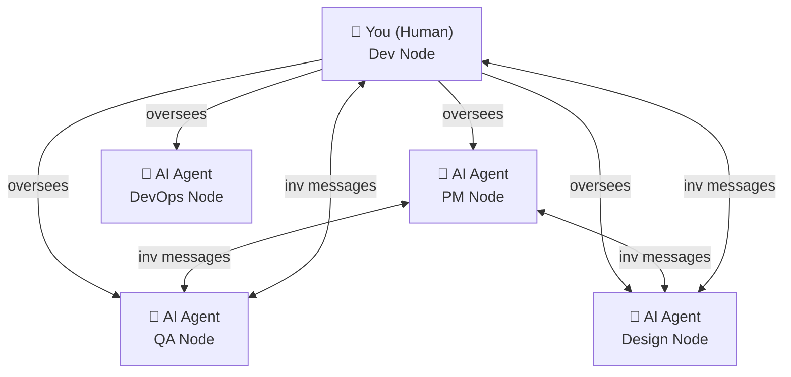
```mermaid
graph TD
    Human["👤 You (Human)<br/>Dev Node"]
    PM["🤖 AI Agent<br/>PM Node"]
    QA["🤖 AI Agent<br/>QA Node"]
    Design["🤖 AI Agent<br/>Design Node"]
    DevOps["🤖 AI Agent<br/>DevOps Node"]

    Human -->|oversees| PM
    Human -->|oversees| QA
    Human -->|oversees| Design
    Human -->|oversees| DevOps

    PM <-->|inv messages| QA
    PM <-->|inv messages| Design
    QA <-->|inv messages| Human
    Design <-->|inv messages| Human
```

## Permission Modes

Two modes, like Claude Code's normal vs. bypass permissions:

| Mode | Description | When to use |
|---|---|---|
| **Normal** | AI suggests, human confirms every action | Learning, sensitive projects, onboarding |
| **Autonomous** | AI operates freely on own node, human handles governance only | Established projects, trusted agents |

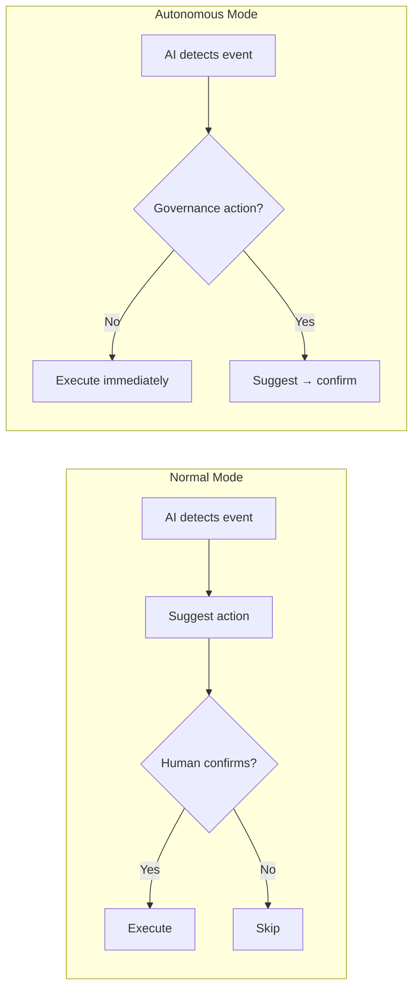
```mermaid
graph LR
    subgraph Normal Mode
        A1[AI detects event] --> A2[Suggest action]
        A2 --> A3{Human confirms?}
        A3 -->|Yes| A4[Execute]
        A3 -->|No| A5[Skip]
    end

    subgraph Autonomous Mode
        B1[AI detects event] --> B2{Governance action?}
        B2 -->|No| B3[Execute immediately]
        B2 -->|Yes| B4[Suggest → confirm]
    end
```

### Permission Matrix

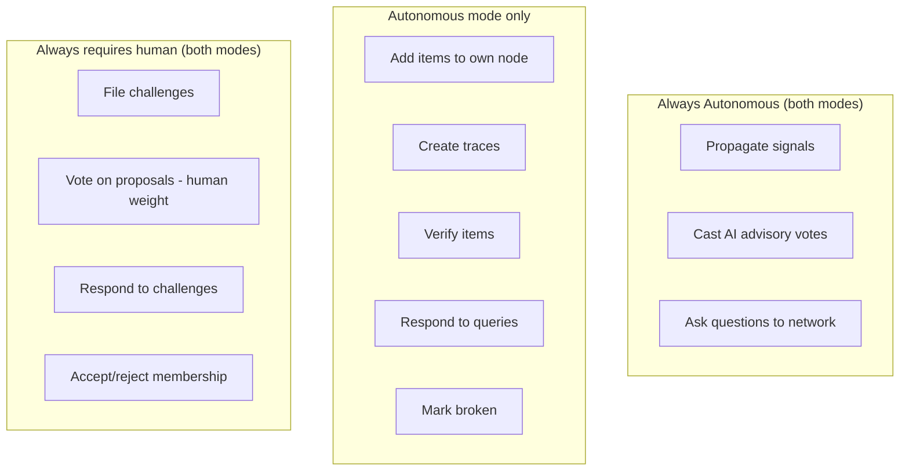
```mermaid
graph TD
    subgraph "Always Autonomous (both modes)"
        AA1[Propagate signals]
        AA2[Cast AI advisory votes]
        AA3[Ask questions to network]
    end

    subgraph "Autonomous mode only"
        AM1[Add items to own node]
        AM2[Create traces]
        AM3[Verify items]
        AM4[Respond to queries]
        AM5[Mark broken]
    end

    subgraph "Always requires human (both modes)"
        HM1[File challenges]
        HM2[Vote on proposals - human weight]
        HM3[Respond to challenges]
        HM4[Accept/reject membership]
    end
```

### Configuration

```yaml
# ~/.inv/config.yaml
node:
  name: claude-pm
  is_ai: true
  permission_mode: autonomous   # or "normal"
```

```bash
inv serve --mode autonomous     # Override at runtime
inv config set permission_mode normal  # Switch modes
```

## Session Workflow

### Session Start — Situational Awareness

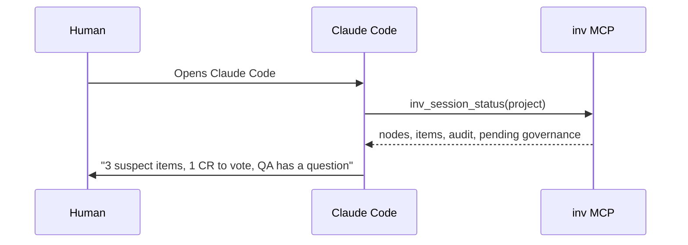
```mermaid
sequenceDiagram
    participant H as Human
    participant C as Claude Code
    participant I as inv MCP

    H->>C: Opens Claude Code
    C->>I: inv_session_status(project)
    I-->>C: nodes, items, audit, pending governance
    C->>H: "3 suspect items, 1 CR to vote, QA has a question"
```

### During Development — Suggest as You Go

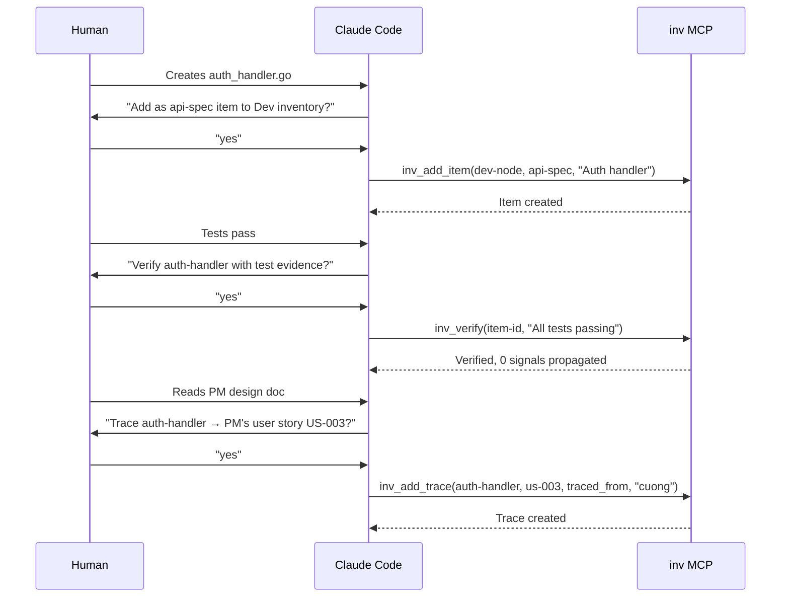
```mermaid
sequenceDiagram
    participant H as Human
    participant C as Claude Code
    participant I as inv MCP

    H->>C: Creates auth_handler.go
    C->>H: "Add as api-spec item to Dev inventory?"
    H->>C: "yes"
    C->>I: inv_add_item(dev-node, api-spec, "Auth handler")
    I-->>C: Item created

    H->>C: Tests pass
    C->>H: "Verify auth-handler with test evidence?"
    H->>C: "yes"
    C->>I: inv_verify(item-id, "All tests passing")
    I-->>C: Verified, 0 signals propagated

    H->>C: Reads PM design doc
    C->>H: "Trace auth-handler → PM's user story US-003?"
    H->>C: "yes"
    C->>I: inv_add_trace(auth-handler, us-003, traced_from, "cuong")
    I-->>C: Trace created
```

### End of Session — Review

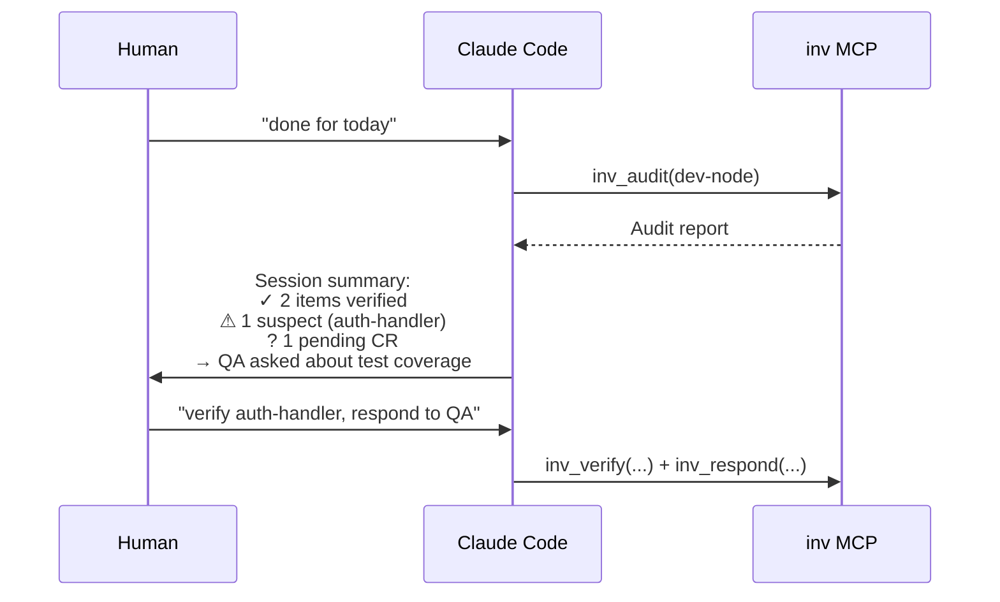
```mermaid
sequenceDiagram
    participant H as Human
    participant C as Claude Code
    participant I as inv MCP

    H->>C: "done for today"
    C->>I: inv_audit(dev-node)
    I-->>C: Audit report
    C->>H: Session summary:<br/>✓ 2 items verified<br/>⚠ 1 suspect (auth-handler)<br/>? 1 pending CR<br/>→ QA asked about test coverage
    H->>C: "verify auth-handler, respond to QA"
    C->>I: inv_verify(...) + inv_respond(...)
```

## Multi-Agent Coordination

### Cross-Agent Communication

AI agents communicate through `inv` network messages — not direct Claude-to-Claude calls.

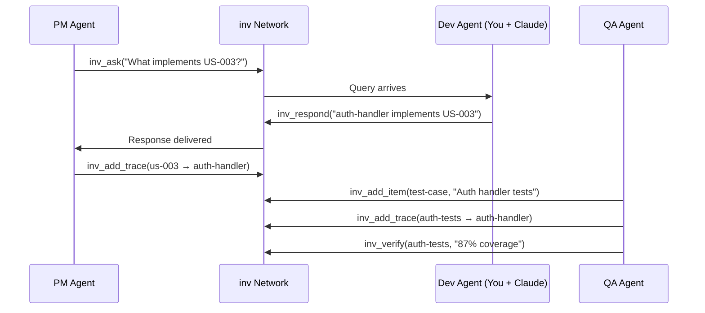
```mermaid
sequenceDiagram
    participant PM as PM Agent
    participant INV as inv Network
    participant Dev as Dev Agent (You + Claude)
    participant QA as QA Agent

    PM->>INV: inv_ask("What implements US-003?")
    INV->>Dev: Query arrives
    Dev->>INV: inv_respond("auth-handler implements US-003")
    INV->>PM: Response delivered

    PM->>INV: inv_add_trace(us-003 → auth-handler)

    QA->>INV: inv_add_item(test-case, "Auth handler tests")
    QA->>INV: inv_add_trace(auth-tests → auth-handler)
    QA->>INV: inv_verify(auth-tests, "87% coverage")
```

### Conflict Resolution Flow

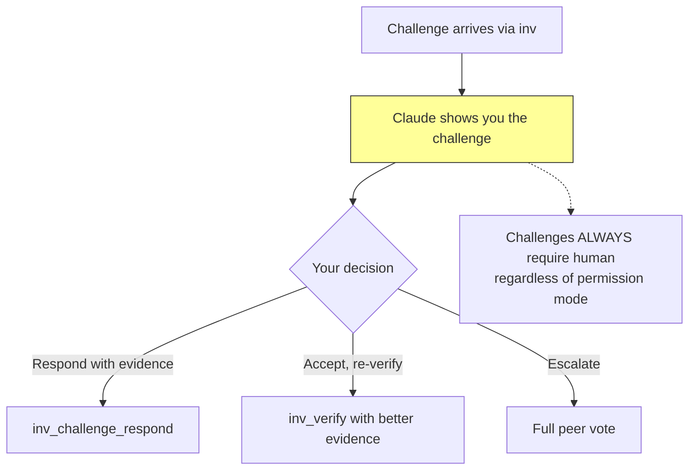
```mermaid
flowchart TD
    A[Challenge arrives via inv] --> B[Claude shows you the challenge]
    B --> C{Your decision}
    C -->|Respond with evidence| D[inv_challenge_respond]
    C -->|Accept, re-verify| E[inv_verify with better evidence]
    C -->|Escalate| F[Full peer vote]

    style B fill:#ff9,stroke:#333
    note1[Challenges ALWAYS require human<br/>regardless of permission mode]
    B -.-> note1
```

### Oversight: Batch Review

Instead of approving every action, review AI activity in batches:

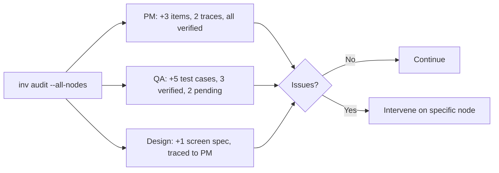
```mermaid
flowchart LR
    A[inv audit --all-nodes] --> B[PM: +3 items, 2 traces, all verified]
    A --> C[QA: +5 test cases, 3 verified, 2 pending]
    A --> D[Design: +1 screen spec, traced to PM]
    B --> E{Issues?}
    C --> E
    D --> E
    E -->|No| F[Continue]
    E -->|Yes| G[Intervene on specific node]
```

## Item Kind Mapping

Claude auto-detects item kinds from file patterns:

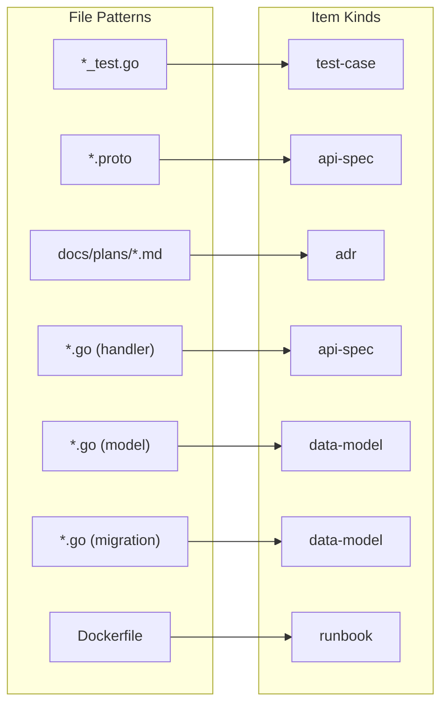
```mermaid
graph LR
    subgraph "File Patterns"
        F1["*_test.go"]
        F2["*.proto"]
        F3["docs/plans/*.md"]
        F4["*.go (handler)"]
        F5["*.go (model)"]
        F6["*.go (migration)"]
        F7["Dockerfile"]
    end

    subgraph "Item Kinds"
        K1[test-case]
        K2[api-spec]
        K3[adr]
        K4[api-spec]
        K5[data-model]
        K6[data-model]
        K7[runbook]
    end

    F1 --> K1
    F2 --> K2
    F3 --> K3
    F4 --> K4
    F5 --> K5
    F6 --> K6
    F7 --> K7
```

## Technical Implementation

### CLAUDE.md Instructions

Each project's CLAUDE.md includes inventory instructions:

```markdown
## Inventory Network

MCP server `inventory` is configured. Project: clinic-checkin.

### Your node
- Node: dev-inventory (vertical: dev, owner: cuong)
- Mode: autonomous

### Session start
Check inventory status at session start:
1. Call inv_session_status for project "clinic-checkin"
2. Summarize: suspect items, pending CRs, unanswered queries

### During development
- New source file → suggest adding item (kind from file pattern)
- Tests pass → suggest verifying related item
- Reading upstream docs → suggest tracing to upstream items
- Bug fix → suggest mark broken then fix

### Governance
- Cast AI advisory votes automatically (is_ai: true)
- Challenges and human-weight votes: always ask first
```

### Claude Code Hooks

```json
{
  "hooks": {
    "PostToolUse": [
      {
        "matcher": "Write|Edit",
        "command": "echo 'INV_HINT: File changed, check if inventory item needs update'"
      }
    ],
    "Stop": [
      {
        "command": "echo 'INV_HINT: Session ending. Run inv audit before closing.'"
      }
    ]
  }
}
```

### New MCP Tools

| Tool | Purpose |
|---|---|
| `inv_session_status` | Combined list + audit for session start (one call) |
| `inv_suggest` | Returns pending suggestions based on recent file changes. Suggestions are generated by Claude Code (via CLAUDE.md instructions and hooks), not by the inv server. This tool queries a local `suggestions` queue populated by hooks. **Deferred to post-MVP** — initial implementation relies on CLAUDE.md instructions alone. |
| `inv_batch_confirm` | Confirm multiple pending suggestions at once. **Deferred to post-MVP.** |
| `inv_config_mode` | Get/set permission mode |
| `inv_pending_events` | Get all pending events that need attention (reconnect/session start) |

### `inv_session_status` Response Type

```go
type SessionStatus struct {
    Nodes          []Node           `json:"nodes"`
    MyNode         Node             `json:"my_node"`
    SuspectItems   []Item           `json:"suspect_items"`
    BrokenItems    []Item           `json:"broken_items"`
    PendingCRs     []ChangeRequest  `json:"pending_crs"`
    ActiveChallenges []Challenge    `json:"active_challenges"`
    UnansweredQueries []Query       `json:"unanswered_queries"`
    AuditReport    AuditReport      `json:"audit_report"`
    PendingEvents  int              `json:"pending_events"`
}
```

Returns only actionable data: non-proven items, pending governance, unanswered queries. Does not return all items (could be large).

## Real-Time Event Notification System

### Architecture: Single Process

`inv serve` runs both P2P and MCP in one process. When a network event arrives, the handler directly pushes a notification to Claude Code via `SendNotificationToClient`.

`inv mcp` (standalone, no P2P) remains for offline/local use.

```bash
inv mcp                          # Standalone MCP, no P2P (offline/local)
inv serve --port 9090            # P2P + MCP combined (full network mode)
```

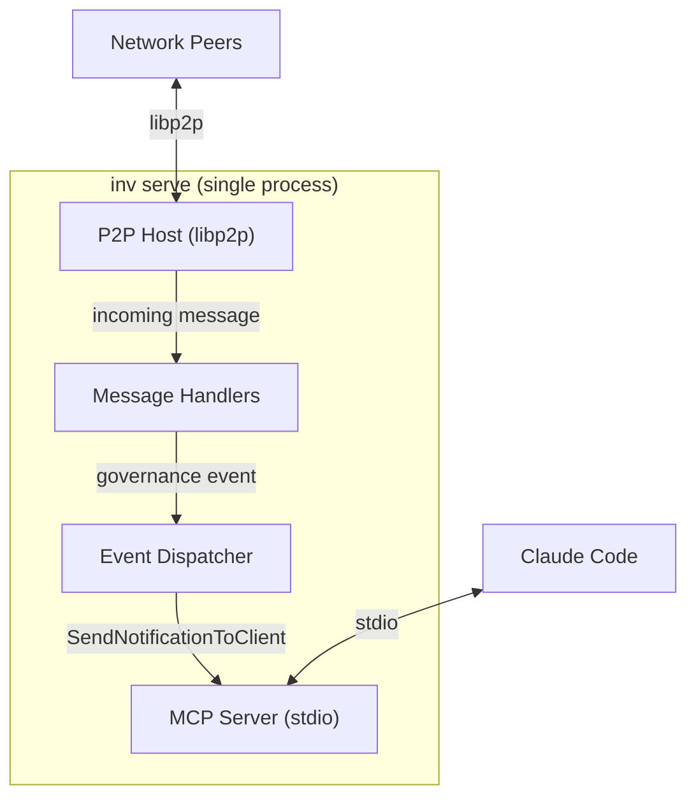
```mermaid
graph TD
    subgraph "inv serve (single process)"
        MCP["MCP Server (stdio)"]
        P2P["P2P Host (libp2p)"]
        EQ["Event Dispatcher"]
        Handlers["Message Handlers"]

        P2P -->|incoming message| Handlers
        Handlers -->|governance event| EQ
        EQ -->|SendNotificationToClient| MCP
    end

    CC["Claude Code"] <-->|stdio| MCP
    Peers["Network Peers"] <-->|libp2p| P2P
```

### Event Types

| Event | Trigger | Urgent | Payload |
|---|---|---|---|
| `governance.challenge_received` | Another node challenges your item/trace | Yes | challenge ID, kind, reason, deadline |
| `governance.vote_requested` | Proposal/CR needs your vote | Yes | proposal ID, kind, title, deadline |
| `governance.proposal_result` | Proposal resolved | No | proposal ID, decision, vote counts |
| `governance.challenge_result` | Challenge resolved | No | challenge ID, outcome, penalty |
| `governance.membership_request` | New node wants to join | Yes | peer ID, name, vertical |
| `network.peer_joined` | Peer came online | No | peer ID, name |
| `network.peer_lost` | Peer went offline | No | peer ID, last seen |
| `network.signal_received` | Your item marked suspect | Yes | item ID, source item, reason |
| `network.query_received` | Another node asked a question | No | query ID, question, asker |
| `network.sweep_received` | Sweep broadcast arrived | No | external ref, matched items |

### Claude Code Reaction Logic

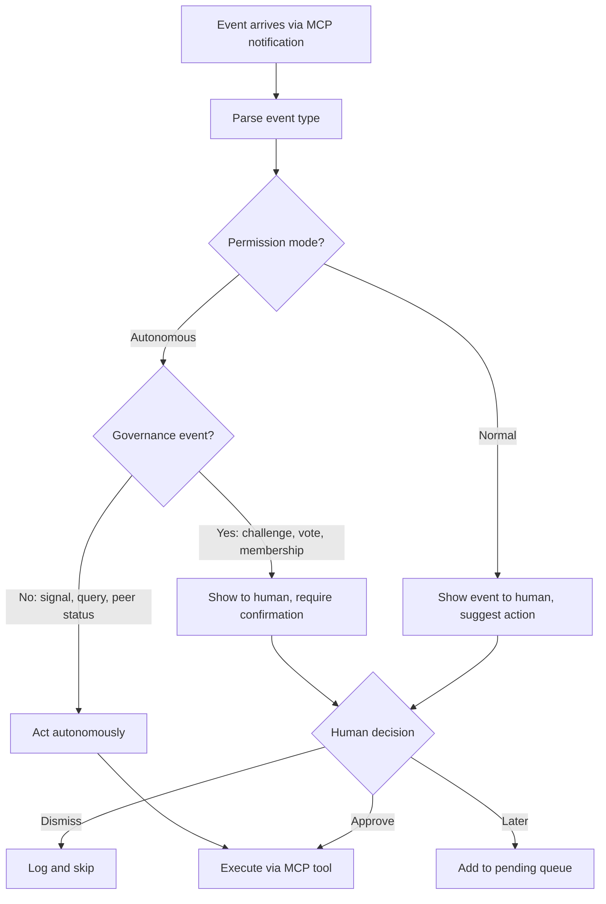
```mermaid
flowchart TD
    EVENT[Event arrives via MCP notification] --> PARSE[Parse event type]
    PARSE --> MODE{Permission mode?}

    MODE -->|Normal| ALWAYS_ASK[Show event to human, suggest action]
    MODE -->|Autonomous| CHECK{Governance event?}

    CHECK -->|Yes: challenge, vote, membership| ASK_HUMAN[Show to human, require confirmation]
    CHECK -->|No: signal, query, peer status| AUTO_ACT[Act autonomously]

    ALWAYS_ASK --> HUMAN_DECIDES{Human decision}
    HUMAN_DECIDES -->|Approve| EXECUTE[Execute via MCP tool]
    HUMAN_DECIDES -->|Dismiss| LOG[Log and skip]
    HUMAN_DECIDES -->|Later| QUEUE[Add to pending queue]

    ASK_HUMAN --> HUMAN_DECIDES
    AUTO_ACT --> EXECUTE
```

### Reaction Matrix Per Event

| Event | Normal mode | Autonomous mode |
|---|---|---|
| `challenge_received` | Show to human, require response | Show to human, require response |
| `vote_requested` | Show to human, require vote | Show to human, require vote |
| `proposal_result` | Show result, no action needed | Show result, no action needed |
| `challenge_result` | Show result, suggest next step | Show result, auto-audit if sustained |
| `membership_request` | Show to human, require approval | Show to human, require approval |
| `peer_joined` | Notify | Silent (log only) |
| `peer_lost` | Notify if outbox has their messages | Silent (log only) |
| `signal_received` | Show to human, suggest re-verify | Auto: `inv impact` → queue re-verify |
| `query_received` | Show to human, suggest response | Auto: generate response, send it |
| `sweep_received` | Show to human, list matched items | Auto: mark suspect, log |

### Event Presentation

When an event arrives mid-conversation, Claude Code interrupts gracefully:

```
🔔 [governance.challenge_received]
QA node (Blue) challenges your item "Auth handler API spec"
  Kind: weak_evidence
  Reason: "Test coverage is only 30%"
  Deadline: 22h remaining

  Actions: [respond with evidence] [view item details] [dismiss for now]
```

In autonomous mode, non-governance events are handled silently and summarized at end of session:

```
Session activity (auto-handled):
  ✓ Responded to 2 queries from PM node
  ✓ Re-verified 1 item after upstream signal
  ⚠ 1 challenge received (requires your response)
```

### Go Implementation

**Event types and dispatcher:**

```go
type EventKind string

const (
    EventChallengeReceived  EventKind = "governance.challenge_received"
    EventVoteRequested      EventKind = "governance.vote_requested"
    EventProposalResult     EventKind = "governance.proposal_result"
    EventChallengeResult    EventKind = "governance.challenge_result"
    EventMembershipRequest  EventKind = "governance.membership_request"
    EventPeerJoined         EventKind = "network.peer_joined"
    EventPeerLost           EventKind = "network.peer_lost"
    EventSignalReceived     EventKind = "network.signal_received"
    EventQueryReceived      EventKind = "network.query_received"
    EventSweepReceived      EventKind = "network.sweep_received"
)

type NodeEvent struct {
    Kind      EventKind   `json:"kind"`
    Timestamp time.Time   `json:"timestamp"`
    Urgent    bool        `json:"urgent"`
    Payload   EventPayload `json:"payload"`
}

// EventPayload — each event kind has a typed payload.
// Only one field is populated per event.
type EventPayload struct {
    Challenge  *ChallengeEventData  `json:"challenge,omitempty"`
    Proposal   *ProposalEventData   `json:"proposal,omitempty"`
    Membership *MembershipEventData `json:"membership,omitempty"`
    Peer       *PeerEventData       `json:"peer,omitempty"`
    Signal     *SignalEventData     `json:"signal,omitempty"`
    Query      *QueryEventData      `json:"query,omitempty"`
    Sweep      *SweepEventData      `json:"sweep,omitempty"`
}

type ChallengeEventData struct {
    ChallengeID string    `json:"challenge_id"`
    Kind        string    `json:"kind"`
    FromPeer    string    `json:"from_peer"`
    TargetItem  string    `json:"target_item"`
    Reason      string    `json:"reason"`
    Deadline    time.Time `json:"deadline"`
    Outcome     string    `json:"outcome,omitempty"`
    Penalty     string    `json:"penalty,omitempty"`
}

type ProposalEventData struct {
    ProposalID string `json:"proposal_id"`
    Kind       string `json:"kind"`
    Title      string `json:"title"`
    Deadline   string `json:"deadline,omitempty"`
    Decision   string `json:"decision,omitempty"`
    VotesFor   int    `json:"votes_for,omitempty"`
    VotesAgainst int  `json:"votes_against,omitempty"`
}

type MembershipEventData struct {
    PeerID   string `json:"peer_id"`
    Name     string `json:"name"`
    Vertical string `json:"vertical"`
}

type PeerEventData struct {
    PeerID   string `json:"peer_id"`
    Name     string `json:"name"`
    LastSeen string `json:"last_seen,omitempty"`
}

type SignalEventData struct {
    ItemID     string `json:"item_id"`
    SourceItem string `json:"source_item"`
    Reason     string `json:"reason"`
}

type QueryEventData struct {
    QueryID  string `json:"query_id"`
    Question string `json:"question"`
    Asker    string `json:"asker"`
}

type SweepEventData struct {
    ExternalRef  string   `json:"external_ref"`
    MatchedItems []string `json:"matched_items"`
}

type EventDispatcher struct {
    mcpServer *server.MCPServer
    agentLog  zerolog.Logger
}

func (d *EventDispatcher) Dispatch(ctx context.Context, event NodeEvent) error {
    d.agentLog.Info().
        Str("event", string(event.Kind)).
        Bool("urgent", event.Urgent).
        Interface("payload", event.Payload).
        Msg("node event")

    if d.mcpServer != nil {
        return d.mcpServer.SendNotificationToClient(ctx, "inventory/event", map[string]interface{}{
            "kind":      event.Kind,
            "timestamp": event.Timestamp,
            "payload":   event.Payload,
            "urgent":    event.Urgent,
        })
    }
    return nil
}
```

**P2P handler emits events:**

```go
func (h *P2PHandlers) HandleChallengeCreate(ctx context.Context, env *pb.Envelope) error {
    challenge := env.GetChallengeCreate()

    err := h.store.SaveChallenge(ctx, challenge)
    if err != nil {
        return err
    }

    h.dispatcher.Dispatch(ctx, NodeEvent{
        Kind:      EventChallengeReceived,
        Timestamp: time.Now(),
        Urgent:    true,
        Payload: EventPayload{
            Challenge: &ChallengeEventData{
                ChallengeID: challenge.ChallengeId,
                Kind:        challenge.Kind,
                FromPeer:    challenge.ChallengerPeer,
                TargetItem:  challenge.TargetItemId,
                Reason:      challenge.Reason,
                Deadline:    time.Now().Add(time.Duration(challenge.DeadlineSeconds) * time.Second),
            },
        },
    })

    return nil
}
```

### Event Persistence

Events are persisted to SQLite so they survive process restarts and can be replayed when Claude Code reconnects.

```sql
CREATE TABLE IF NOT EXISTS events (
    id         TEXT PRIMARY KEY,
    kind       TEXT NOT NULL,
    payload    TEXT NOT NULL,
    urgent     INTEGER DEFAULT 0,
    read       INTEGER DEFAULT 0,
    created_at DATETIME DEFAULT CURRENT_TIMESTAMP
);
```

The `EventDispatcher` writes every event to the `events` table before pushing via MCP. `inv_pending_events` queries `SELECT * FROM events WHERE read = 0 ORDER BY created_at`. After the client acknowledges, events are marked `read = 1`. Events older than 7 days are pruned on startup.

### Complete Notification Flow

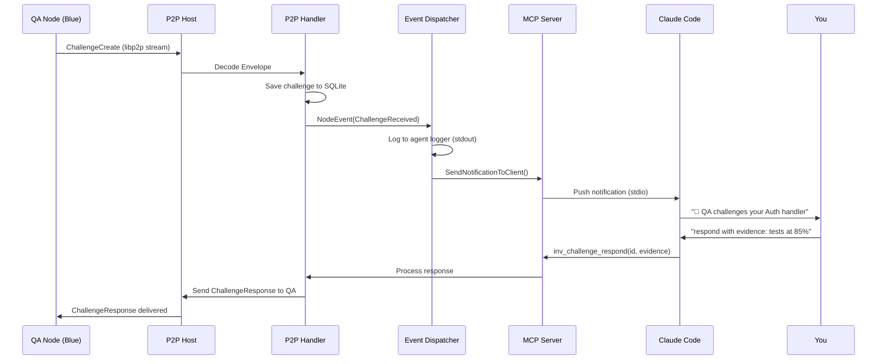
```mermaid
sequenceDiagram
    participant Peer as QA Node (Blue)
    participant P2P as P2P Host
    participant Handler as P2P Handler
    participant Dispatch as Event Dispatcher
    participant MCP as MCP Server
    participant CC as Claude Code
    participant Human as You

    Peer->>P2P: ChallengeCreate (libp2p stream)
    P2P->>Handler: Decode Envelope
    Handler->>Handler: Save challenge to SQLite
    Handler->>Dispatch: NodeEvent{ChallengeReceived}
    Dispatch->>Dispatch: Log to agent logger (stdout)
    Dispatch->>MCP: SendNotificationToClient()
    MCP->>CC: Push notification (stdio)
    CC->>Human: "🔔 QA challenges your Auth handler"
    Human->>CC: "respond with evidence: tests at 85%"
    CC->>MCP: inv_challenge_respond(id, evidence)
    MCP->>Handler: Process response
    Handler->>P2P: Send ChallengeResponse to QA
    P2P->>Peer: ChallengeResponse delivered
```

## Human Flows & Use Cases

### Use Case: Team Onboarding

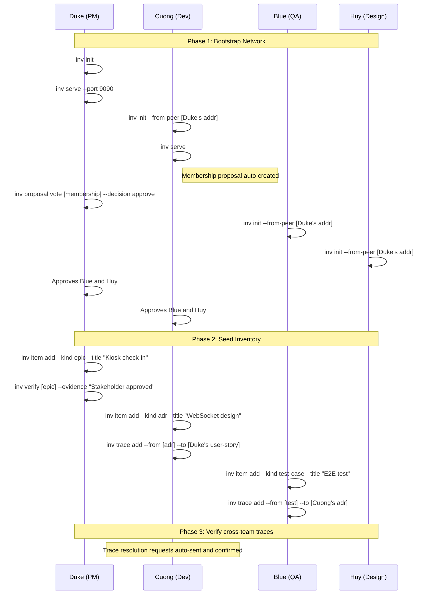
```mermaid
sequenceDiagram
    participant Duke as Duke (PM)
    participant Cuong as Cuong (Dev)
    participant Blue as Blue (QA)
    participant Huy as Huy (Design)

    Note over Duke,Huy: Phase 1: Bootstrap Network

    Duke->>Duke: inv init
    Duke->>Duke: inv serve --port 9090

    Cuong->>Cuong: inv init --from-peer [Duke's addr]
    Cuong->>Cuong: inv serve
    Note right of Cuong: Membership proposal auto-created

    Duke->>Duke: inv proposal vote [membership] --decision approve

    Blue->>Blue: inv init --from-peer [Duke's addr]
    Huy->>Huy: inv init --from-peer [Duke's addr]
    Duke->>Duke: Approves Blue and Huy
    Cuong->>Cuong: Approves Blue and Huy

    Note over Duke,Huy: Phase 2: Seed Inventory

    Duke->>Duke: inv item add --kind epic --title "Kiosk check-in"
    Duke->>Duke: inv verify [epic] --evidence "Stakeholder approved"

    Cuong->>Cuong: inv item add --kind adr --title "WebSocket design"
    Cuong->>Cuong: inv trace add --from [adr] --to [Duke's user-story]

    Blue->>Blue: inv item add --kind test-case --title "E2E test"
    Blue->>Blue: inv trace add --from [test] --to [Cuong's adr]

    Note over Duke,Huy: Phase 3: Verify cross-team traces
    Note over Cuong: Trace resolution requests auto-sent and confirmed
```

### Use Case: Developer Daily Workflow

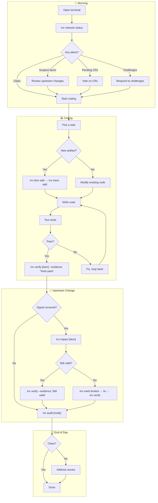
```mermaid
flowchart TD
    subgraph "🌅 Morning"
        M1[Open terminal] --> M2["inv network status"]
        M2 --> M3{Any alerts?}
        M3 -->|Suspect items| M4[Review upstream changes]
        M3 -->|Pending CRs| M5[Vote on CRs]
        M3 -->|Challenges| M6[Respond to challenges]
        M3 -->|Clean| M7[Start coding]
        M4 --> M7
        M5 --> M7
        M6 --> M7
    end

    subgraph "💻 Coding"
        M7 --> C1[Pick a task]
        C1 --> C2{New artifact?}
        C2 -->|Yes| C3["inv item add → inv trace add"]
        C2 -->|No| C4[Modify existing code]
        C3 --> C6[Write code]
        C4 --> C6
        C6 --> C7[Run tests]
        C7 --> C8{Pass?}
        C8 -->|Yes| C9["inv verify [item] --evidence 'Tests pass'"]
        C8 -->|No| C10[Fix, loop back]
        C10 --> C6
    end

    subgraph "🔄 Upstream Change"
        C9 --> P1{Signal received?}
        P1 -->|Yes| P2["inv impact [item]"]
        P2 --> P3{Still valid?}
        P3 -->|Yes| P4["inv verify --evidence 'Still valid'"]
        P3 -->|No| P5["inv mark-broken → fix → inv verify"]
        P1 -->|No| E1
    end

    subgraph "🌆 End of Day"
        P4 --> E1["inv audit [node]"]
        P5 --> E1
        E1 --> E2{Clean?}
        E2 -->|Yes| E3[Done]
        E2 -->|No| E4[Address issues]
        E4 --> E3
    end
```

### Use Case Catalog

| # | Use Case | Flow |
|---|---|---|
| UC-1 | Add new artifact | `inv item add` → `inv trace add` → code → `inv verify` |
| UC-2 | Handle suspect item | Signal → `inv impact` → review → `inv verify` or `inv mark-broken` |
| UC-3 | Vote on CR | `inv cr list` → review → `inv cr vote` |
| UC-4 | Respond to question | `inv query list --incoming` → `inv query respond` |
| UC-5 | Check dependents | `inv impact [item]` |
| UC-6 | Check dependencies | `inv trace up [item]` |
| UC-7 | Audit node health | `inv audit [node]` |
| UC-8 | External change | `inv sweep --ref "JIRA-123"` → broadcast → items marked suspect |

### Cross-Team Flows

#### Flow 1: PM Changes a Requirement

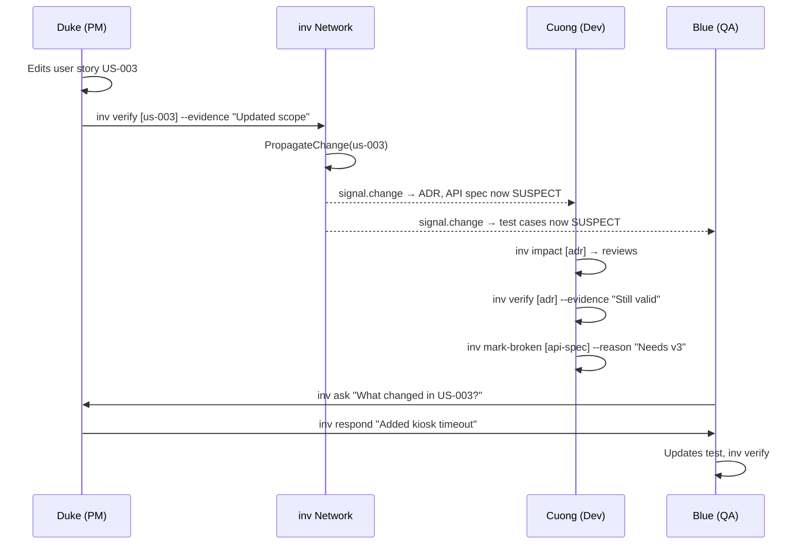
```mermaid
sequenceDiagram
    participant PM as Duke (PM)
    participant INV as inv Network
    participant Dev as Cuong (Dev)
    participant QA as Blue (QA)

    PM->>PM: Edits user story US-003
    PM->>INV: inv verify [us-003] --evidence "Updated scope"
    INV->>INV: PropagateChange(us-003)
    INV-->>Dev: signal.change → ADR, API spec now SUSPECT
    INV-->>QA: signal.change → test cases now SUSPECT

    Dev->>Dev: inv impact [adr] → reviews
    Dev->>Dev: inv verify [adr] --evidence "Still valid"
    Dev->>Dev: inv mark-broken [api-spec] --reason "Needs v3"

    QA->>PM: inv ask "What changed in US-003?"
    PM->>QA: inv respond "Added kiosk timeout"
    QA->>QA: Updates test, inv verify
```

#### Flow 2: Dev Proposes a Change Request

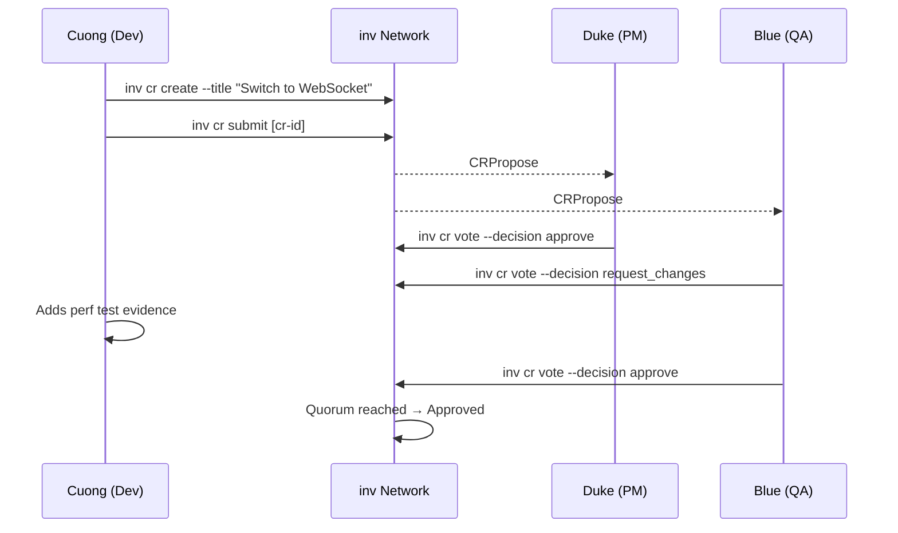
```mermaid
sequenceDiagram
    participant Dev as Cuong (Dev)
    participant INV as inv Network
    participant PM as Duke (PM)
    participant QA as Blue (QA)

    Dev->>INV: inv cr create --title "Switch to WebSocket"
    Dev->>INV: inv cr submit [cr-id]
    INV-->>PM: CRPropose
    INV-->>QA: CRPropose

    PM->>INV: inv cr vote --decision approve
    QA->>INV: inv cr vote --decision request_changes

    Dev->>Dev: Adds perf test evidence
    QA->>INV: inv cr vote --decision approve

    INV->>INV: Quorum reached → Approved
```

#### Flow 3: QA Challenges Dev's Verification

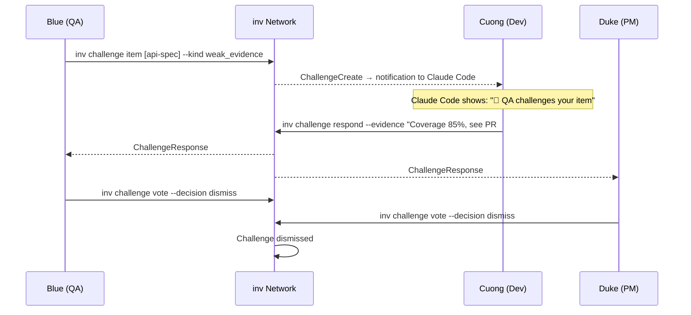
```mermaid
sequenceDiagram
    participant QA as Blue (QA)
    participant INV as inv Network
    participant Dev as Cuong (Dev)
    participant PM as Duke (PM)

    QA->>INV: inv challenge item [api-spec] --kind weak_evidence
    INV-->>Dev: ChallengeCreate → notification to Claude Code
    Note over Dev: Claude Code shows: "🔔 QA challenges your item"

    Dev->>INV: inv challenge respond --evidence "Coverage 85%, see PR #47"
    INV-->>QA: ChallengeResponse
    INV-->>PM: ChallengeResponse

    QA->>INV: inv challenge vote --decision dismiss
    PM->>INV: inv challenge vote --decision dismiss
    INV->>INV: Challenge dismissed
```

#### Flow 4: External Sweep

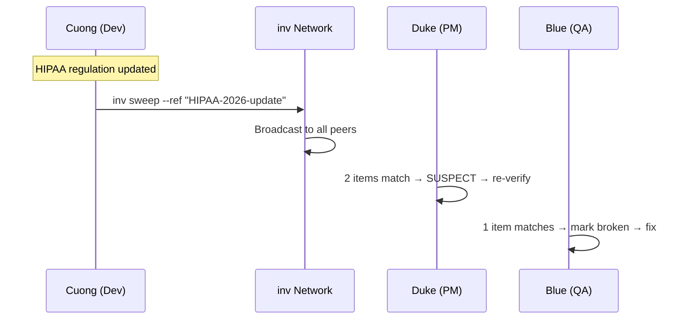
```mermaid
sequenceDiagram
    participant Dev as Cuong (Dev)
    participant INV as inv Network
    participant PM as Duke (PM)
    participant QA as Blue (QA)

    Note over Dev: HIPAA regulation updated
    Dev->>INV: inv sweep --ref "HIPAA-2026-update"
    INV->>INV: Broadcast to all peers

    PM->>PM: 2 items match → SUSPECT → re-verify
    QA->>QA: 1 item matches → mark broken → fix
```

#### Flow 5: Trace Dispute (Owner Veto)

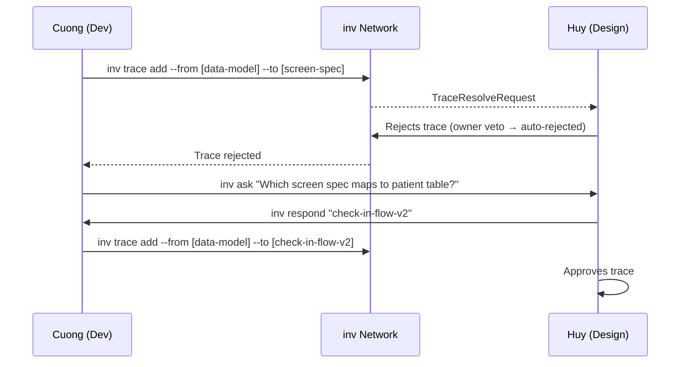
```mermaid
sequenceDiagram
    participant Dev as Cuong (Dev)
    participant INV as inv Network
    participant Design as Huy (Design)

    Dev->>INV: inv trace add --from [data-model] --to [screen-spec]
    INV-->>Design: TraceResolveRequest

    Design->>INV: Rejects trace (owner veto → auto-rejected)
    INV-->>Dev: Trace rejected

    Dev->>Design: inv ask "Which screen spec maps to patient table?"
    Design->>Dev: inv respond "check-in-flow-v2"

    Dev->>INV: inv trace add --from [data-model] --to [check-in-flow-v2]
    Design->>Design: Approves trace
```

#### Flow 6: New Team Member Joins

```mermaid
sequenceDiagram
    participant New as Alex (DevOps)
    participant INV as inv Network
    participant Dev as Cuong (Dev)
    participant PM as Duke (PM)

    New->>New: inv init --from-peer [Dev's addr]
    INV->>INV: Auto-creates membership proposal
    Note over New: Status: PENDING

    INV-->>Dev: notification: membership_request
    INV-->>PM: notification: membership_request

    Dev->>INV: inv proposal vote --decision approve
    PM->>INV: inv proposal vote --decision approve
    INV->>INV: Quorum → Approved

    New->>New: Status: APPROVED → full participation
```

## Complete Workflow — End to End

```mermaid
flowchart TD
    START[Open Claude Code] --> STATUS[inv_session_status + inv_pending_events]
    STATUS --> SUMMARY[Claude summarizes state + pending events]
    SUMMARY --> WORK[Start working]

    WORK --> CODE[Write/edit code]
    CODE --> DETECT[Claude detects file change]
    DETECT --> MODE{Permission mode?}

    MODE -->|Normal| SUGGEST[Suggest inventory action]
    SUGGEST --> CONFIRM{Human confirms?}
    CONFIRM -->|Yes| EXECUTE[Execute via MCP]
    CONFIRM -->|No| WORK

    MODE -->|Autonomous| GOVCHECK{Governance action?}
    GOVCHECK -->|No| EXECUTE
    GOVCHECK -->|Yes| SUGGEST

    EXECUTE --> PROPAGATE[Propagate signals if needed]
    PROPAGATE --> WORK

    WORK -.->|Real-time event arrives| EVENT[MCP push notification]
    EVENT --> URGENT{Urgent?}
    URGENT -->|Yes| INTERRUPT[Show immediately to human]
    URGENT -->|No| BATCH[Queue for session summary]
    INTERRUPT --> WORK
    BATCH --> WORK

    WORK --> DONE[Session ending]
    DONE --> AUDIT[inv_audit all nodes + show batched events]
    AUDIT --> REVIEW[Claude shows summary]
    REVIEW --> FIX{Fix issues?}
    FIX -->|Yes| EXECUTE
    FIX -->|No| END[Close session]
```

## Implementation Order

1. **Combined serve + MCP** — merge P2P host and MCP server into single `inv serve` process
2. **Event types** — define `NodeEvent`, `EventKind` constants
3. **Event dispatcher** — `EventDispatcher` bridges P2P handlers → `SendNotificationToClient`
4. **P2P handler integration** — emit events from all message handlers
5. **inv_pending_events MCP tool** — get unread events for session start/reconnect
6. **inv_session_status MCP tool** — combined node list + audit + pending events
7. **Permission mode** — config field, runtime flag, reaction matrix logic
8. **CLAUDE.md template** — standard inventory instructions for projects
9. **Item kind mapping** — file pattern → item kind detection logic
10. **inv_suggest MCP tool** — pending suggestion queue
11. **inv_batch_confirm MCP tool** — batch confirmation
12. **Claude Code hooks** — PostToolUse and Stop hooks
13. **inv_config_mode MCP tool** — get/set permission mode
14. **Multi-node audit** — `inv audit --all-nodes` for oversight
15. **Tests** — event dispatch tests, notification integration tests, workflow scenario tests
